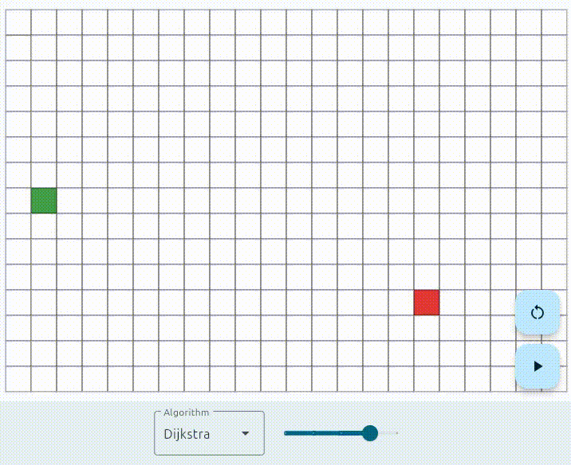

# pathy

A visualizer for pathfinding algorithms

# Features

- Visualize pathfinding algorithms (currently A* and Dijkstra)
- Change the visualization speed
- Pause and resume the visualization
- Set walls
- The grid is responsive to the window size
- Move start and end node via drag and drop

# Supported platforms

- Linux
- Android
